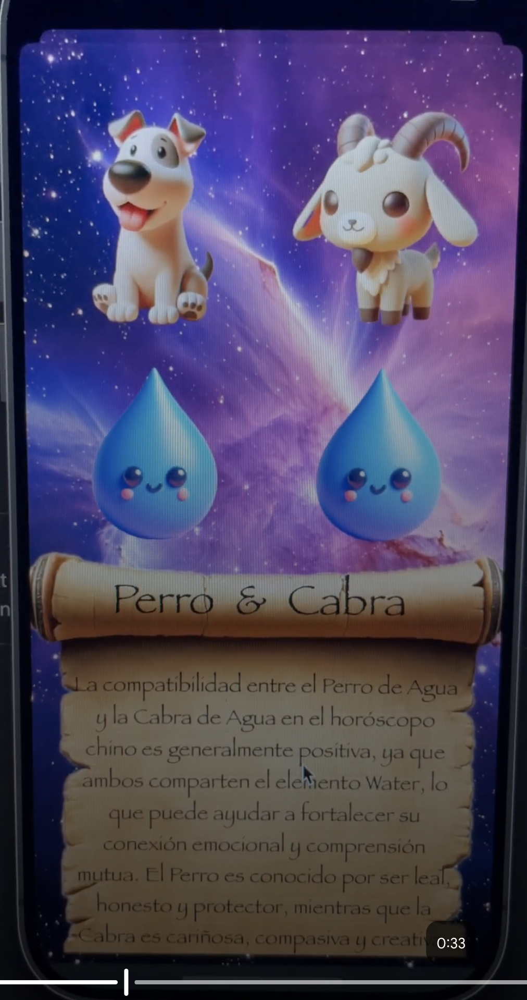
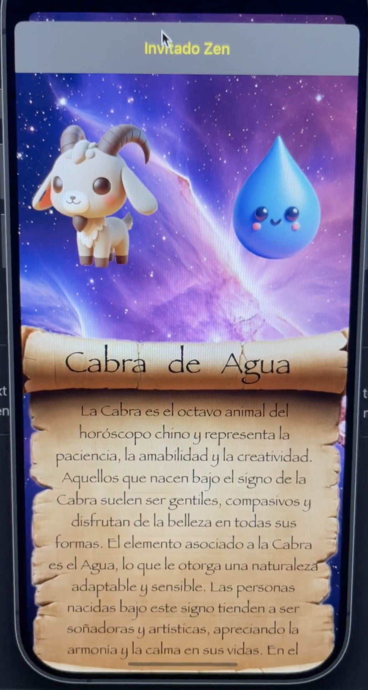
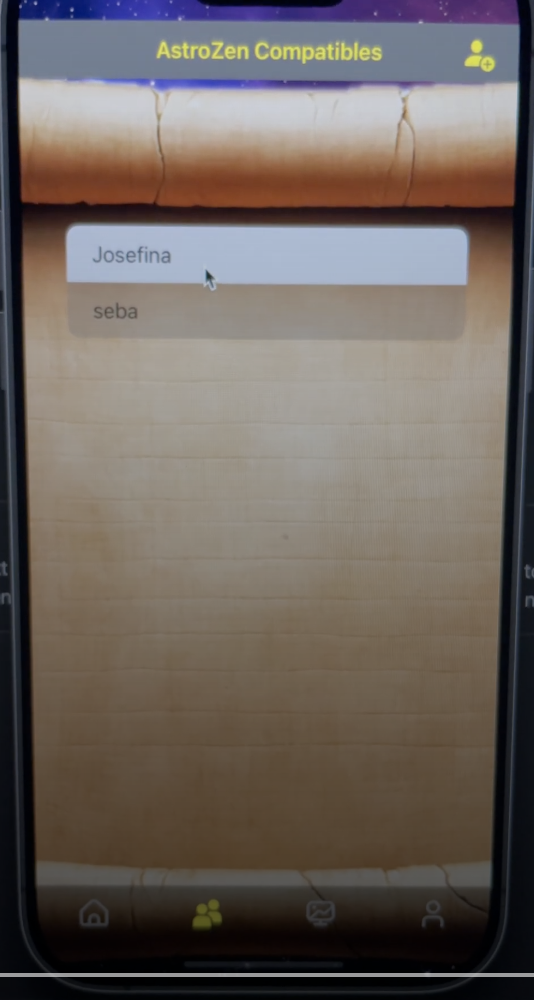
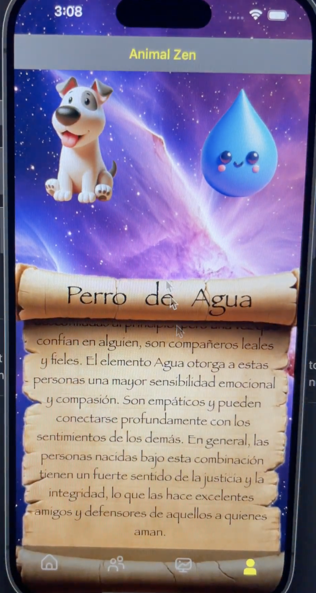

# 🌌 AstroZen  

---

## ✨ Overview  

**AstroZen** is a personal project fully developed in **Xcode**, created as part of my professional growth as an iOS developer.  
The app combines **modern technology** with **ancient Chinese wisdom**, offering users an **interactive, visual, and personalized experience** to test compatibility between people.  

---

## 🚀 Tech Stack  

- **Swift** → complete, native iOS development  
- **OpenAI API + DALL·E 3** → AI-powered personalized image generation  
- **Firebase** → authentication and cloud storage  
- **MVVM + Core Data** → clean architecture and local persistence  
- **Adaptive UX/UI** → responsive design, animations, and immersive user experience  
- **GitHub** → version control and project management  

---

## 📱 Main Features  

- Personalized compatibility based on Chinese astrology  
- Unique image generation powered by AI  
- Animations and adaptive design for an immersive feel  
- Secure authentication and cloud storage with Firebase  
- Offline-ready with Core Data local persistence  

---

## 📸 Screenshots

|                     Home                     |                         Match                       |                      Guess                       |                                    
| :------------------------------------------: | :--------------------------------------------------:| :----------------------------------------------: | 
|  |   |  | 

|                        Comp                        |                     Profile                     |
| :------------------------------------------------: | :---------------------------------------------: |
|  |  |

---

## 🛠️ Installation & Setup  

Clone the repository:  

git clone https://github.com/GermanBonnettini/AstroZen.git
cd AstroZen
Open the project in Xcode 15+

Make sure you have iOS 17+ (simulator or device)

Configure Firebase with your GoogleService-Info.plist file

Run the project on a simulator or real device with ⌘R

---

## 📂 Project Structure

AstroZen.xcodeproj → main project file

Resources/ → assets, images, and resources

CoreData/ → persistent data models

Views/ → SwiftUI interfaces

ViewModels/ → business logic under MVVM

---

## 🎥 Demo

👉 Watch demo on LinkedIn
(Video may not reflect the final version)

---

## 📌 Roadmap

Refine UI/UX details

Add more social interactions

Expand compatibility features

Prepare for App Store launch

---

## 🧑‍💻 Author

**German Bonnettini**  
iOS & Game Developer  
🎮 Creating interactive and visually immersive mobile experiences.  
📍 [Matecode Studio](https://matecodestudio.io/)

---

## 📜 License
This project is shared for portfolio and learning purposes.
Licensed under the MIT License. See LICENSE for more details.
